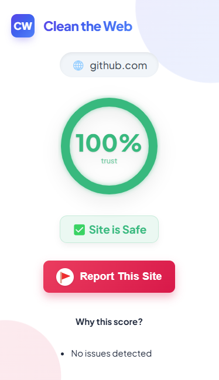
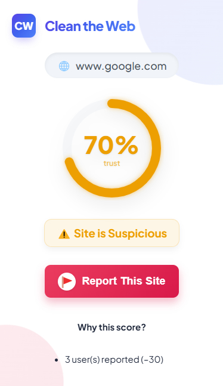
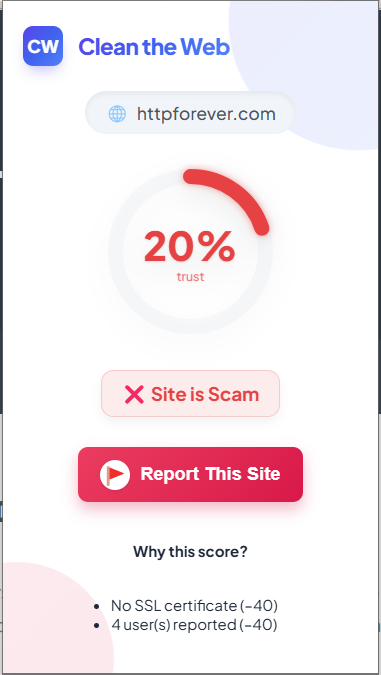
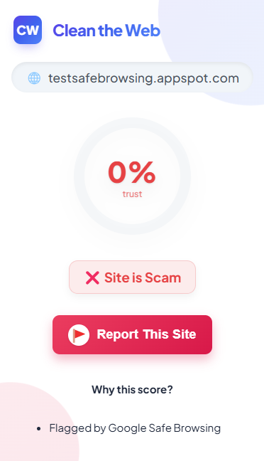

<div align="left">
    
    <div style="display: inline-block;">
        <h1 style="display: inline-block; vertical-align: middle; margin-top: 0;">Clean The Web</h1>
        <p><em>Protecting users from phishing, scams, and shady websites — in real time.</em></p>
        <p>
            
            
            
            
        </p>
        <p>Built with:</p>
        <p>
            
            
            
            
            
            
            
            
        </p>
    </div>
</div>

<br clear="left"/>

---

<details><summary>📜 Table of Contents</summary>

- [📖 Overview](#-overview)
- [✨ Features](#-features)
- [🛠️ Tech Stack](#-tech-stack)
- [🎯 Trust Score Calculation](#-trust-score-calculation)
- [📂 Project Structure](#-project-structure)
- [🚀 Getting Started](#-getting-started)

</details>

---

## 📖 Overview

**Clean The Web** is a modern cybersecurity Chrome extension and full-stack system that detects phishing, fake, and scam websites.

It uses **real technical signals** like SSL certificates, domain age, suspicious keywords, and crowdsourced reports to determine a website’s **trust score** — giving users an instant, clear verdict on site safety.

---

## 📸 Extension Screenshots

<div align="center">
  
  
  
  
</div>

---

## ✨ Features

| 🚀  |            Feature            | Description                                                       |
| :-- | :---------------------------: | :---------------------------------------------------------------- |
| 🧹  |   **Real-Time Site Check**    | Analyze current website instantly inside your browser             |
| 🧠  |     **Smart Trust Score**     | Based on SSL, domain age, suspicious keywords, and user reports   |
| 📈  | **Trust Score Visualization** | Animated circular indicator showing trust percentage              |
| 📜  |     **Explanation Panel**     | Shows exactly why a site was rated Safe / Suspicious / Scam       |
| 🔒  | **Google Safe Browsing API**  | Real-time lookup of known phishing/malware URLs                   |
| 📢  |  **Crowdsourced Reporting**   | Users can report suspicious sites to strengthen the system        |
| 🧩  |    **Full-Stack Backend**     | Node.js API with MongoDB database to handle reports and site data |

---

## 🛠️ Tech Stack

| Technology                         | Usage                                           |
| :--------------------------------- | :---------------------------------------------- |
| **Chrome Extension APIs**          | Building the browser extension                  |
| **Node.js + Express.js**           | Backend server to process site checks           |
| **MongoDB + Mongoose**             | Database to store site reports, domain metadata |
| **Axios**                          | API communication with backend and WhoisXML     |
| **WhoisXML API**                   | Checking domain registration age                |
| **Google Safe Browsing API**       | Real-time threat lookup for URLs                |
| **Frontend (HTML/CSS/JavaScript)** | Extension popup and dashboard UI                |
| **(Future) Next.js**               | Public web dashboard (optional)                 |

---

## 🎯 Trust Score Calculation

The trustScore starts at **100** and is dynamically adjusted based on the following:

1. **Start:**  
   trustScore = 100

2. **SSL Check:**  
   ❌ No SSL certificate → `trustScore -= 40`

3. **Domain Age Check:**  
   ❌ Domain age < 6 months → `trustScore -= 30`

4. **Suspicious Keywords Check:**  
   ❌ Domain contains suspicious words (login, verify, account, paypal) → `trustScore -= 20`

5. **User Reports Check:**  
   ❌ Each report → `trustScore -= 10`

6. **Clamp:**  
   ❌ If trustScore < 0 → Clamp to 0

7. **Set Status:**
   - ✅ `trustScore ≥ 80` → **Safe**
   - ⚠️ `trustScore < 80 and ≥ 50` → **Suspicious**
   - ❌ `trustScore < 50` → **Scam**

> **Rating Guide:**
>
> - **Safe:** No major red flags—SSL valid, established domain, no reports, AND not flagged by Google Safe Browsing.
> - **Suspicious:** Minor concerns (young domain, or one warning) but not outright malicious.
> - **Scam:** Significant issues (multiple reports, or any Google Safe Browsing flag).

✅ TrustScore and Explanation are both displayed to the user for full transparency.

---

## 📂 Project Structure

```bash
/extension
  ├── popup.html
  ├── popup.js
  ├── styles.css
  ├── icons/ (browser action icons)

 /backend
  ├── server.js
  ├── routes/
  │   └── siteRoutes.js
  ├── models/
  │   └── Site.js
  ├── .env (Mongo URI + Whois API Key)

 /database
  └── MongoDB Atlas (Cloud database)
```

## 🚀 Getting Started

### 📋 Prerequisites

Before getting started with **Clean The Web**, ensure your environment meets the following:

- **Programming Language:** JavaScript (Node.js)
- **Package Manager:** npm
- **Database:** MongoDB Atlas (or local MongoDB)
- **Chrome Browser:** For extension testing

### 🛠️ Installation

Install **Clean The Web** using the following steps:

**Build from source:**

1. Clone the repository:

```bash
git clone https://github.com/AlexanderPotiagalov/clean-the-web
```

2. Navigate to the project directory:

```bash
cd backend
```

3. Install backend dependencies:

```bash
npm install
```

4. Create a `.env` file:

```bash
MONGO_URI=your-mongodb-connection-string
WHOIS_API_KEY=your-whoisxmlapi-key
```

5. Start the server:

```bash
npm run dev
```

✅ Server will run at:

```bash
http://localhost:5000
```

### 🧩 Chrome Extension Setup

1. Open Chrome → Go to `chrome://extensions`
2. Enable **Developer Mode** (top right)
3. Click **Load Unpacked**
4. Select the `/extension` folder
5. 🎉 The extension is now active!

## Contributing

- **💬 [Join the Discussions](https://github.com/AlexanderPotiagalov/Clean-the-Web-Extension/discussions)**: Share your insights, provide feedback, or ask questions.
- **🐛 [Report Issues](https://github.com/AlexanderPotiagalov/Clean-the-Web-Extension/issues)**: Submit bugs found or log feature requests.
- **💡 [Submit Pull Requests](https://github.com/AlexanderPotiagalov/Clean-the-Web-Extension/blob/main/CONTRIBUTING.md)**: Review open PRs, and submit your own PRs.

## 🧑‍💻 Author

Built by **Alexander Potiagalov**

Protecting users from online scams, one website at a time.
